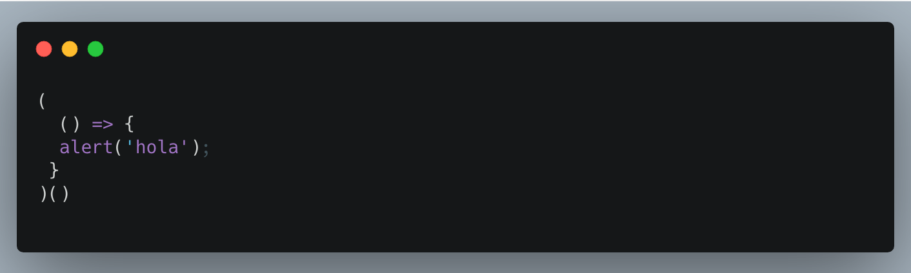
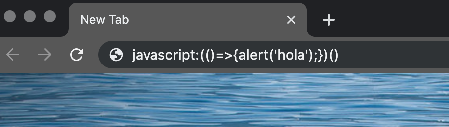

# Bookmarklet, el Hello Word de las extensiones

Los Bookmarklet son atajos que nos van a permitir hacer algunas tareas mucho más simples. Por medio de funciones javascript vamos a ejecutar acciones en web que no son nuestras, lo que vamos a tratar en este capitulo no es una nueva tecnología, existe desde la década de los 90’ cuando se usaba con el navegador Nestcape para realizar acciones que no permitía de forma nativa.

Una gran diferencia entre Bookmarklet y las extensiones es que las primeras son universales, las podemos utilizar en cualquier navegador (no disponible para navegadores en dispositivos móviles)
La instalación también es simple, solamente se debe agregar el link a la barra de marcadores o favoritos y nos queda disponible al alcance de un click.

---
## Hello Word

Antes de armar nuestro primer Bookmarklet vamos a hablar un poco de javascript.
Las funciones que vamos a utilizar son del tipo Self invoking las cuales se van a ejecutar en el momento de la declaración.



Este código podemos usarlo directamente en la barra del navegador de la siguiente manera



Realizar esta tarea de llevar el código a la barra de navegación no es cómodo, para esto nos vamos a ayudar con un archivo html el cual tendrá un link en el cual tendrá nuestra url como la usamos recién.

```
<a href=“javascript:(()=>{})()”>Ejemplo 1</a>
```


**Armemos nuestro primer Bookmarklet juntos.**

	* Usando un archivo HTML crear un link el cual nos pida nuestro nombre y luego imprimirlo en la consola del navegador.

	* Cargar ese link como un Bookmarklet y ejecutarlo.


### 🆘  [Solución](../bookmarklet/ejemplo1.html)

### ⏩  [Siguiente](./02_bookmarklet.md)