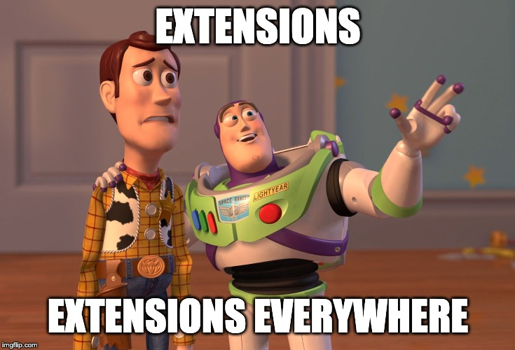

# Extensions, Extensions Everywhere

Las extensiones son una de las características más útiles de los navegadores actuales y no paramos de descargarlas sin saber de dónde salen. Vos estas seguro que queres seguir haciendo eso? sumate al workshop y juntos vamos a aprender a armar nuestras extensiones y tomar el control de nuestro navegador.

> En este workshop *no* vamos a hablar sobre cómo publicar extensiones en los store de los navegadores.

## Durante este workshop vamos a aprender:

  * Crear y aplicar bookmarklets
  * Como utilizar HTML, CSS y JS para desarrollar una extension.

## Temas

* [Bookmarklet](./docs/01_bookmarklet.md)
* Extensiones
  * [Manifest](./docs/03_manifest.md)
  * [ContentScript](./docs/04_contentScript.md)
  * [BackgroundScript](./docs/05_backgroundScript.md)
  * [Pop-up](./docs/06_popups.md)